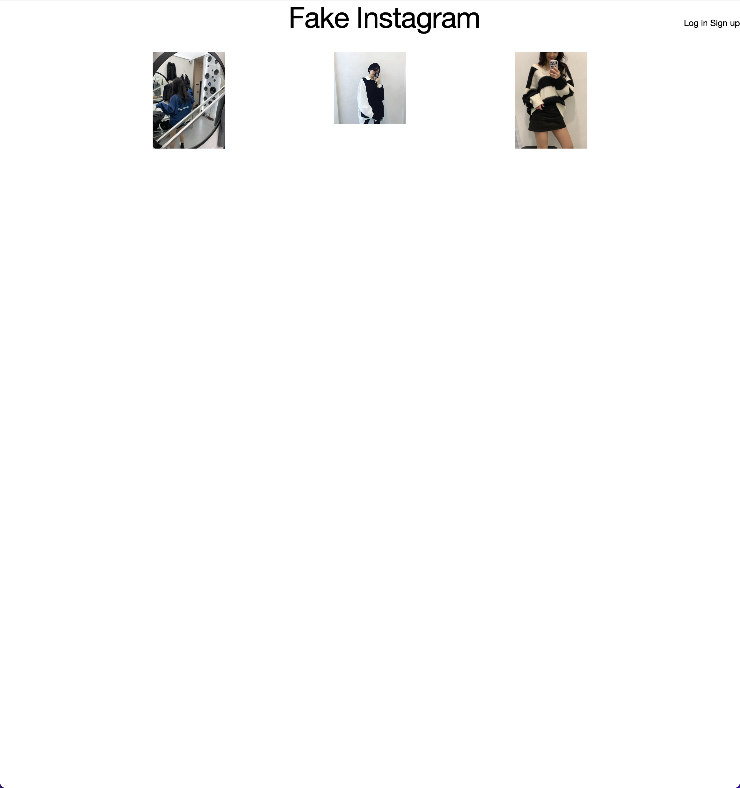

# Fake Instagram

I want to try to make some SNS application such as Instagram.

## Technologies Used
<ul>
<li>HTML</li>
<li>CSS</li>
<li>Skeleton Boilerplate</li>
<li>Node.js</li>
<li>Express</li>
<li>MongoDB/Mongoose</li>
</ul>

## Screenshots

## Getting Started

The Project's <a href='https://trello.com/b/60YKHuaE/project-2-fake-instagram' target='_blank'>planning</a> 
This is deployed app on <a href='https://fakeinstagramxx.herokuapp.com/'>Netlify</a>

## Future Enhancements

<ul>
    <li>Authorization</li>
    <li>Categorized Ability</li>
    <li>Like/Dislike Ability</li>
    <li>File Uploader</li>
</ul>